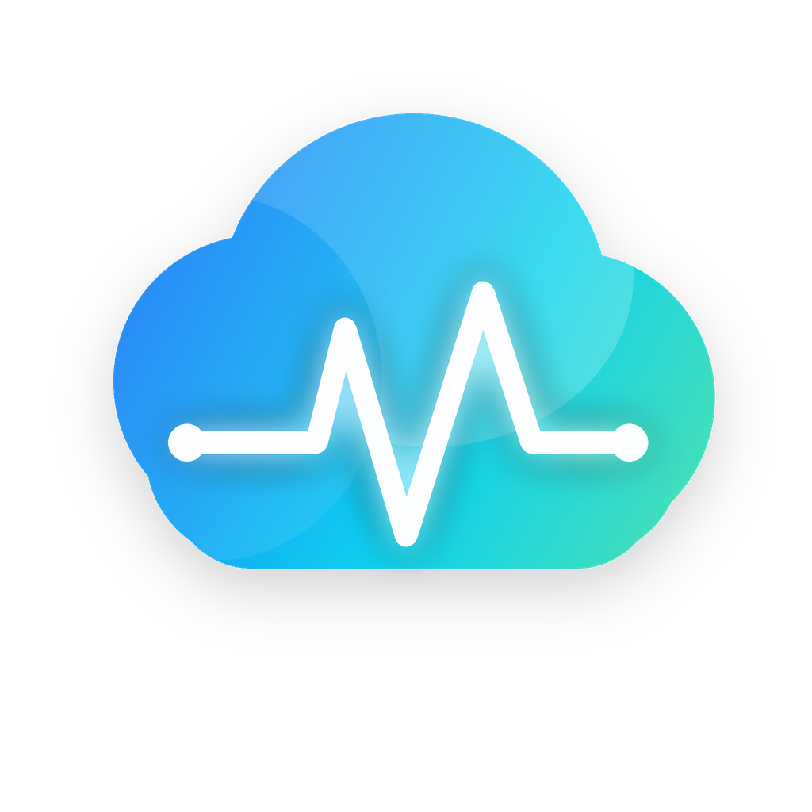

<h1 align="center">
  <br>
  Not Just You
</h1>

Not Just You helps AI tool users check whether a problem is only on their
machine or showing up across a wider surface.

It combines a compact public dashboard, official provider status, CLI/MCP status
lookup, AI-client plugins, and opt-in metadata-only installed-client signals.
Manual community reporting remains available as a fallback signal.

## Use It

### Dashboard

Open [Web Dashboard](https://notjustyou.dev/#dashboard) to see recent
AI service signals with separate rows for official status, community reports,
and installed-client signals.

### CLI

Install the CLI for terminal status checks:

```bash
npm install -g @notjustyou/cli
njy status
njy status anthropic-claude-code
njy status openai-api --watch
```

### MCP

Use the MCP server with AI clients that support stdio MCP tools:

```bash
npm install -g @notjustyou/mcp
```

Configure `notjustyou-mcp` as a stdio server in your AI client. The MCP tools
read public status summaries and can walk through explicit local reporting setup
when supported.

### Plugins

Claude Code:

```text
/plugin marketplace add dobbylee/notjustyou
/plugin install notjustyou@notjustyou
```

Codex:

```bash
codex plugin marketplace add dobbylee/notjustyou
codex plugin add notjustyou@notjustyou
```

Codex installs from this GitHub repository as a Codex marketplace source. It is
not distributed as an npm plugin package.

The Cursor Marketplace now accepts community submissions, but Not Just You is
not listed there yet. Cursor and Antigravity plugins are distributed as packages
and currently use manual local plugin installation. See:

- [Cursor plugin](packages/notjustyou-cursor-plugin)
- [Antigravity plugin](packages/notjustyou-antigravity-plugin)
- [Claude Code plugin](packages/notjustyou-claude-code-plugin)
- [Codex plugin](packages/notjustyou-codex-plugin)

### SDK

Use the Node SDK when you want your own OpenAI, Anthropic, or Gemini API wrapper
to contribute opt-in metadata-only failure signals:

```bash
njy setup --service openai-api
npm install @notjustyou/sdk-js
```

Supported SDK service ids are `openai-api`, `anthropic-claude-api`, and
`google-gemini-api`. See [packages/notjustyou-sdk-js](packages/notjustyou-sdk-js)
for wrapper usage.

## Privacy

Not Just You is designed to collect the smallest metadata needed to show
service-level status.

- No account or login is required.
- Manual community reports, official status, and installed-client signals stay
  separate in storage and API contracts.
- Local hook reporting is opt-in. Local adapters may process vendor hook payloads
  in memory to derive normalized metadata, but raw payload fields are not stored,
  queued, logged, or sent.
- Not Just You does not store prompt text, messages, commands, shell output,
  request or response bodies, headers, API keys, cookies, source files, diffs,
  file paths, clipboard content, exact IP addresses, account emails, machine
  names, local usernames, or workspace identifiers.

Raw collector tokens are saved only in local Not Just You config by setup tools
and sent only as bearer auth to the configured Not Just You API. Raw collector
tokens are not stored server-side.

## More

- [CLI](packages/notjustyou-cli)
- [MCP server](packages/notjustyou-mcp)
- [Architecture notes](docs/architecture.md)
- [Signal design](docs/signals.md)
- [Development guide](docs/development.md)
- [Contributing](CONTRIBUTING.md)

## License

[MIT](LICENSE)
